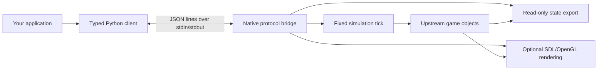

# Architecture and roadmap

[English](architecture.md) | [简体中文](architecture.zh-CN.md) · [Home](../README.md)

## Runtime boundary

Each `GameClient` owns one native process, its pipes and temporary state directory.
The protocol runs on the game thread. Snapshots are copied at complete update
boundaries; iteration does not move legacy game collection cursors. The client
validates response IDs, types and capability promises and never retries actions.

Synchronous ticks update game logic at the upstream 50 fps reference scale.
Rendering is separate and does not consume the gameplay RNG stream. Display
mode and headless mode share simulation code; headless skips video, texture/font
and audio initialization. It still uses the same linked executable.

Reset reconstructs episode-owned state in the same process. RNG tables use the
platform C library, so repeatability is scoped to the same build and platform.
The first `hero_dead` or `level_over` freezes the single-level episode.

## Repository map

| Path | Responsibility |
| --- | --- |
| `game/` | Vendored release source and assets; upstream notices retained |
| `game/src/rl/` | Native JSON-lines transport, commands and state serialization |
| `chromium_rl/` | Typed Python client, actions and validated state |
| `examples/` | Native headless rollout, GUI control and live inspection |
| `scripts/` | Local build, distribution checks and diagnostic tools |
| `tests/` | Python transport/parsers and native behavior regressions |
| `docs/` | Current language pairs and explicitly historical evidence |
| `.github/` | CI and contribution templates |
| `build/`, `artifacts/`, `dist/` | Ignored generated output |

## Versioning and compatibility

The Python package is at 0.2.0 (alpha). It is independent from protocol v1,
snapshot schema v2, and game behavior `seeded-reset-v3`. Query capabilities rather
than inferring feature support from the Python version. Additive instrumentation
does not itself change game behavior; changed RNG or tick semantics need explicit
behavior versioning and new trajectory comparisons. During 0.x, breaking changes
must be described in the changelog and both language guides.

## Future work

| Direction | Work still required |
| --- | --- |
| Gymnasium adapter | Specify observation encoding, reward, truncation and lifecycle semantics |
| Full-game tasks | Implement and validate level transitions, respawn and final completion |
| Learning examples | Training implementation, evaluation protocol and measured results |
| Portable native packages | Per-platform builds, dependency/asset bundling and runtime acceptance |
| Batched CPU and GPU simulation | Isolate per-environment state, design array interfaces and validate behavior |

These are directions, not shipped APIs or delivery commitments. Consumers can
build task-specific wrappers today using the raw state and events.

The [performance guide](performance.md) explains throughput measurements,
consumer bottlenecks and the separate work required for GPU learning or simulation.

Historical implementation plans are retained in [design.md](design.md).
[Validation records](README.md#validation-records) describe their original scope;
build success, headless behavior, display behavior and policy performance remain
separate claims.
