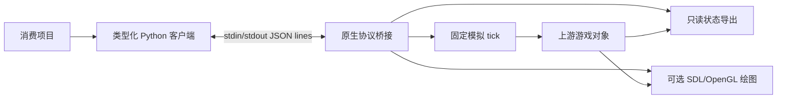

# 架构与后续方向

[English](architecture.md) | [简体中文](architecture.zh-CN.md) · [首页](../README.zh-CN.md)

## 运行时边界

每个 `GameClient` 拥有一个原生进程、管道和临时状态目录。协议在游戏主线程处理，
快照在完整更新边界复制，遍历不改变原版对象集合游标。客户端校验响应 ID、类型及能力声明，不自动重试动作。

同步 tick 使用原版 50 fps 参考尺度。绘图独立，不消耗游戏逻辑 RNG 序列。
显示与无显示模式共用模拟代码；无显示模式跳过视频、纹理/字体及音频初始化，但仍使用链接相同库的程序。

reset 在同一进程中重建回合状态。随机表使用平台 C 库，所以复现范围限定于相同构建和平台。
首次进入 `hero_dead` 或 `level_over` 后冻结单关回合。

## 仓库结构

| 路径 | 职责 |
| --- | --- |
| `game/` | 上游发行源码、资源与原始许可声明 |
| `game/src/rl/` | 原生 JSON-lines 传输、命令、状态序列化 |
| `chromium_rl/` | Python 客户端、动作与状态校验 |
| `examples/` | 无显示运行、GUI 控制和实时读取示例 |
| `scripts/` | 本地构建、分发检查和诊断工具 |
| `tests/` | Python 传输/解析测试与原生行为回归 |
| `docs/` | 当前双语指南，以及明确标记的历史记录 |
| `.github/` | CI 与贡献模板 |
| `build/`、`artifacts/`、`dist/` | 忽略提交的生成产物 |

## 版本与兼容性

Python 包为 0.2.0（Alpha），与协议 v1、快照 schema v2、游戏行为 `seeded-reset-v3` 分别管理。
应查询 capabilities，不根据 Python 版本猜测原生功能。
只增加测量字段不代表改变游戏行为；改变 RNG 或 tick 语义需要明确行为版本并重新比较轨迹。
0.x 阶段的破坏性变更必须在变更记录与两种语言指南中说明。

## 后续方向

| 方向 | 尚需工作 |
| --- | --- |
| Gymnasium 适配 | 明确观察编码、奖励、截断与生命周期 |
| 整局任务 | 实现并验收关卡切换、复活与最终完成判据 |
| 学习示例 | 训练实现、评估流程和实测结果 |
| 可移植原生包 | 各平台构建、依赖/资源打包与运行验收 |

这些是后续方向，不是已交付接口或时间承诺。消费项目现在可以基于原始状态和事件实现自己的任务包装。

历史实现规划保留在 [design.md](design.md)。[验证记录](README.md#validation-records)
按其原始范围解读，构建成功、无显示行为、显示行为和策略表现分别报告。
